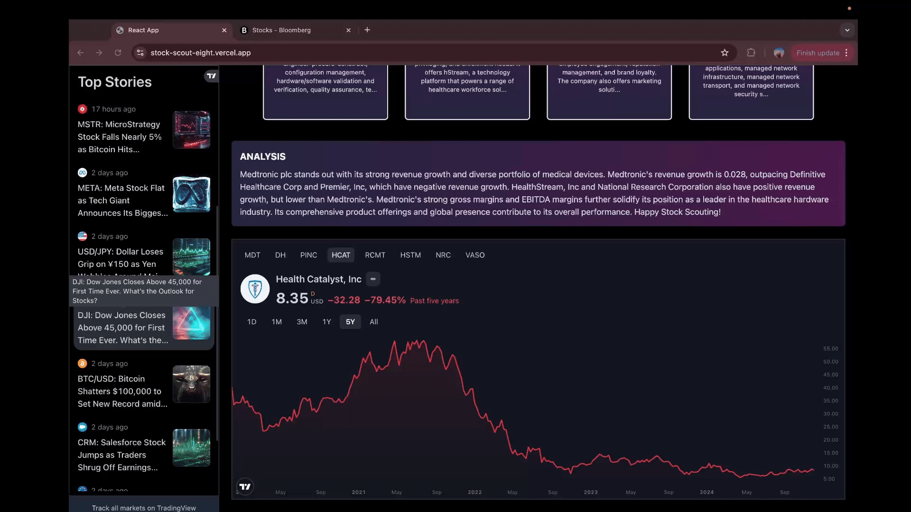

# :chart:StockScout - An AI driven platform for stock exploration 

## :books:About
StockScout is an AI-driven platform designed to simplify stock exploration and analysis using natural language queries. StockScout leverages technologies like Pinecone for semantic search and Llama 3.3 for intelligent responses within a Retrieval-Augmented Generation (RAG) workflow.

<div align="center">
<h3>StockScout Dashboard</h3>
 
 
</div>

## :video_camera:Deployed App Demo on youtube
<div align="center">
  <a href="https://www.youtube.com/watch?v=qOYk5196HGM">
    
  </a>
</div>

## :rocket:Technologies
### Front-End


### Back-End 


### Other Tools/ Embedding + RAG + Generative AI 


### Deployment


## :gear: Key Features

 Semantic search-based stock discovery for natural language queries.

 AI-generated query responses and stock comparisons.

 Interactive UI with stock cards showcasing details like market cap, revenue growth, etc.

 TradingView widget for real-time stock price graph

 TradingView widget for real-time market news


## :rocket: RAG Workflow

 
  - Retrieved stock tickers from SEC, then fetched metadata via Yahoo Finance API.
  - Used parallel processing for fetching stock data
  - Implemented exponential backoff and ticker bucketing to handle Yahoo Finance API rate limits

 
  - Use Hugging Face to embed stock descriptions (business summaries) and stored them in Pinecone.

  
  - Embedded user query and conducted semantic similarity search (cosine similarity search) in Pinecone to find top 8 matches.

 
  -  Leveraged Llama 3.3-70b-versatile to generate responses to queries and a comparision and analysis of the top 8 stocks based on the query. 
 


  - Embedded TradingView's real-time graphs and stock price detail widgets displayed using React components.


  - Deployed web application using Render and Vercel
     
## :computer: Application Architecture


 - Built with **React** for an intuitive and dynamic user experience
 - Deployed on **Vercel** for scalability and reliability


 - Powered by **Flask**, which handles API services and integrates with AI tools
 - Deployed on **Render** for seamless performance


 - Used Pinecone to store embedded stock descriptions
 - Embeddings generated via Hugging Face


 - Leveraged Llama 3.3 to generate responses to query and conduct relevant stock analysis
   
## :sparkles:Getting Started
### Prerequisites


### Installation
1. Clone the repo
```sh
git clone https://github.com/Pallavi25Kishore/StockScout.git
```

2. Navigate to client folder and install NPM packages
```sh
cd client
npm install
```

3. Navigate to client/src/components/App.js and change all fetch urls to http://localhost:5001 instead of public url for deployed backend on render 
```sh
//fetch('https://stockscout.onrender.com/..........')
fetch('http://localhost:5001/..........')
```

4. Run in dev environment
```sh
npm start
```

5. Navigate to server folder and activate virtual environment
```sh
source venv/bin/activate
```

6. Install dependencies
```sh
pip install -r requirements.txt
```

7. Make a copy of the server/.exampleenv file and rename it to .env. Enter the following in the .env file
```sh
GROQ_API_KEY=<groqapikey>
PINECONE_API_KEY=<pineconeapikey>
```

8. Navigate to server/app.py. Comment out and uncomment out the code such that the final code looks as follows:
```sh
#for running on local
if __name__ == '__main__':
    app.run(debug=True, port=5001)

#for deplyment on Render
#if __name__ == '__main__':
    #app.run(host='0.0.0.0', port=int(os.environ.get("PORT", 5000)))
```

9. Start the flask server
```sh
python3 app.py
```


